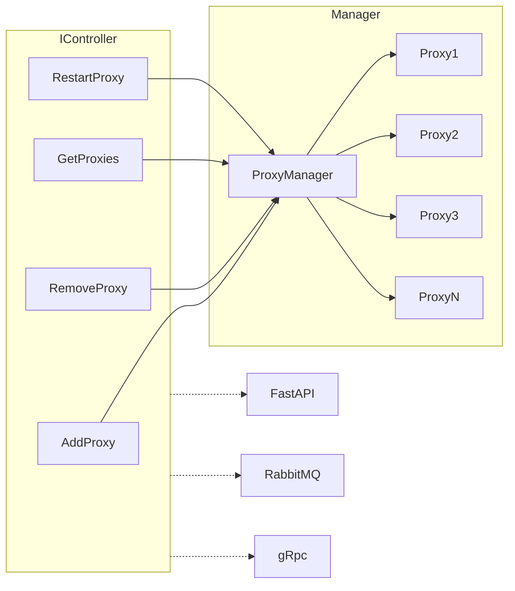
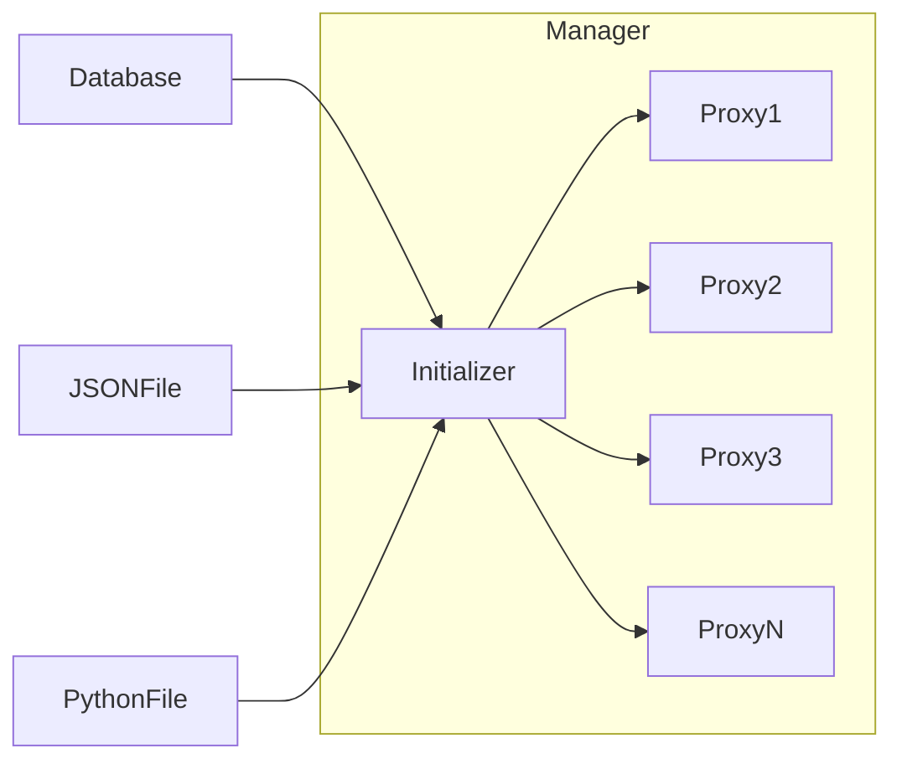

# Soccer Monitor Proxy

This is a Python project designed for RoboCup's 2D soccer simulation. The project creates a proxy for the soccer monitor, enabling it to send and receive data from UDP, RabbitMQ, and WebSocket. The proxy can be controlled using FastAPI.

## Architecture

### Proxy Manager and Controller



### Initialization



## Installation

To install the required packages, use `pipenv`:

```sh
pipenv install
```

## Running the Project

To run the project, execute the following command:

```sh
python monitor_proxy.py
```

## Docker

The project is Dockerized. To build and run the Docker container, use the following commands:

```sh
docker build . -t proxy
docker run -it --network host proxy
```

## Configuration

The project uses a `data.json` file located at the root of the project to initialize the proxies.

### Input Configurations

#### UDP Input
```json
{
    "type": "UDP",
    "host": "localhost",
    "port": 6000
}
```

#### RabbitMQ Input
```json
{
    "type": "RMQ",
    "queue": "test3"
}
```

### Output Configurations

#### UDP Output
```json
{
    "type": "UDP",
    "host": "localhost",
    "port": 6900
}
```

#### RabbitMQ Output
```json
{
    "type": "RMQ",
    "queue": "test3"
}
```

### Queue Configurations

#### Delayed Queue
```json
{
    "type": "DELAYED",
    "delay": 50
}
```

#### Simple Queue
```json
{
    "type": "SIMPLE"
}
```

### Aggregated Example

Below is an example of the `data.json` file encompassing various configurations:

```json
{
    "proxies": [
        {
            "input": {
                "type": "UDP",
                "host": "localhost",
                "port": 6000
            },
            "output": [
                {
                    "type": "UDP",
                    "host": "localhost",
                    "port": 6900
                }
            ],
            "queue": {
                "type": "DELAYED",
                "delay": 50
            }
        },
        {
            "input": {
                "type": "RMQ",
                "queue": "test3"
            },
            "output": [
                {
                    "type": "UDP",
                    "host": "localhost",
                    "port": 6700
                }
            ],
            "queue": {
                "type": "SIMPLE"
            }
        },
        {
            "input": {
                "type": "UDP",
                "host": "localhost",
                "port": 6000
            },
            "output": [
                {
                    "type": "RMQ",
                    "queue": "test3"
                }
            ],
            "queue": {
                "type": "DELAYED",
                "delay": 50
            }
        },
        {
            "input": {
                "type": "RMQ",
                "queue": "test3"
            },
            "output": [
                {
                    "type": "UDP",
                    "host": "localhost",
                    "port": 6800
                }
            ],
            "queue": {
                "type": "SIMPLE"
            }
        },
        {
            "input": {
                "type": "UDP",
                "host": "localhost",
                "port": 6000
            },
            "output": [
                {
                    "type": "RMQ",
                    "queue": "test3"
                }
            ],
            "queue": {
                "type": "DELAYED",
                "delay": 50
            }
        },
        {
            "input": {
                "type": "RMQ",
                "queue": "test3"
            },
            "output": [
                {
                    "type": "UDP",
                    "host": "localhost",
                    "port": 6700
                }
            ],
            "queue": {
                "type": "SIMPLE"
            }
        },
        {
            "input": {
                "type": "UDP",
                "host": "localhost",
                "port": 6000
            },
            "output": [
                {
                    "type": "RMQ",
                    "queue": "test3"
                }
            ],
            "queue": {
                "type": "DELAYED",
                "delay": 50
            }
        },
        {
            "input": {
                "type": "RMQ",
                "queue": "test3"
            },
            "output": [
                {
                    "type": "UDP",
                    "host": "localhost",
                    "port": 6900
                }
            ],
            "queue": {
                "type": "SIMPLE"
            }
        }
    ]
}
```

## License

This project is licensed under the AGPL-3.0 License.