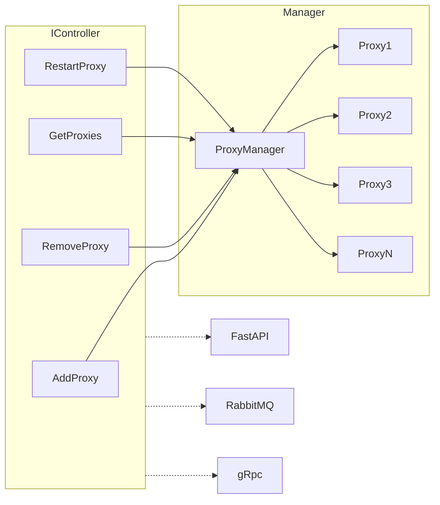
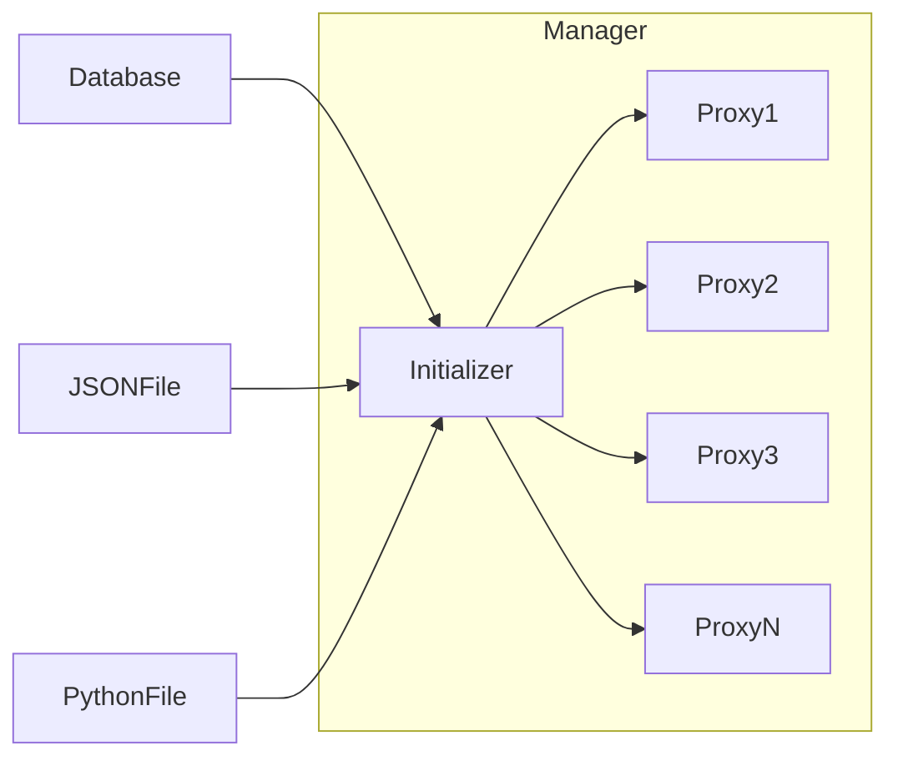

```mermaid
flowchart LR
    subgraph Manager
        ProxyManager
        Proxy1
        Proxy2
        Proxy3
        ProxyN
    end
    subgraph IController
        AddProxy
        RemoveProxy
        GetProxies
        RestartProxy
    end
    IController -.-> FastAPI & RabbitMQ & gRpc
    ProxyManager --> Proxy1 & Proxy2 & Proxy3 & ProxyN


    AddProxy & RemoveProxy & GetProxies & RestartProxy --> ProxyManager
```

```mermaid
flowchart LR
    subgraph Manager
        Initializer
        Proxy1
        Proxy2
        Proxy3
        ProxyN
    end
    Database & JSONFile & PythonFile --> Initializer --> Proxy1 & Proxy2 & Proxy3 & ProxyN
```